import { Tooltip, TooltipTrigger, TooltipContent, cn } from "@lemonade-stand/ui"

import img_mechanic_web_blades from "./images/mythic/ansurek/mechanic.web-blades.png"
import img_mechanic_shadowgate from "./images/mythic/ansurek/mechanic.shadowgate.png"

## Contents

## Links
- **WarcraftLogs**: [Kills with our healing comp](https://www.warcraftlogs.com/zone/rankings/38?boss=2922&metric=execution&search=5.2.1%2C6.1.1%2C7.2.1%2C9.3.1).

## Required Setup

1. Under `Queen Ansurek` in BigWigs find the first mechanic, [Reactive Toxin](https://www.wowhead.com/spell=437592/reactive-toxin), click the `>>` arrows, and disable `Say` and `Say Countdown`.
1. Disable `Reactive Toxin Marker`.


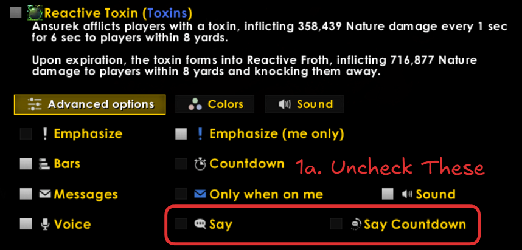

3. Search for `Web Blades` in your WeakAuras, or find the aura named `Web Blades` under `Nerub-ar Palace`, `Queen Ansurek`, `Queen Ansurek - Bars`. This aura is set to load Never by default. Uncheck that to turn it back on. If you want to modify this WeakAura to make a sound when it's safe to move, view instructions [here](/guides/nerubar-palace/web-blades-sounds).

  <figure className="justify-self-center">

    <Image src={img_mechanic_web_blades} alt="" className="mx-auto" />

    <figcaption>
    The green ticks are when the Web Blades spawn, and the red ticks are when they erupt.
    </figcaption>
  </figure>

4. Tanks need to find the Weakaura below in the assignment auras and enable it. They should also review our [assignments sheet](https://docs.google.com/spreadsheets/d/1NwLOCed-NoyBckvTx0fGHEXRyp-kDW6XdNEV7dN-qR0/edit?gid=680015118#gid=680015118) and in the custom options pick the correct markers for the first and third Ascended Voidspeaker for their side.

   ```
   Voidspeaker Automark - CUSTOM OPTIONS + DISABLED BY DEFAULT
   ```

## Mechanics

<Tabs defaultValue="1">
  <TabsList>
    <TabsTrigger value="1">Phase 1</TabsTrigger>
    <TabsTrigger value="2">Intermission</TabsTrigger>
    <TabsTrigger value="3">Phase 2</TabsTrigger>
    <TabsTrigger value="4">Phase 3</TabsTrigger>
  </TabsList>

  <TabsContent value="1" variant="ghost">
    <Mechanic id="437592" name="Reactive Toxin" caption="Sets 2 and 3 spawn 3 bombs instead of 2.">
    The major change to Phase 1, the 2nd and 3rd set of Reactive Toxin goes out 3 players, spawning 3 [Reactive Froth](https://www.wowhead.com/spell=438846) bombs instead of 2. Be weary of looking at old preparation materials for this fight as the third set used to have 4 bombs (2-3-4), post-nerf it’s 2-3-3.
    </Mechanic>

    <Mechanic id="460133" name="Toxic Reaction" caption="Bomb popping must be staggered.">
    When a [Reactive Froth](https://www.wowhead.com/spell=438846) bomb is popped everyone is given a 2000% vulnerability to this mechanic for 1 second, requiring bomb popping to be staggered. 
    </Mechanic>

    <Mechanic id="439814" name="Silken Tomb" caption="Roots need to be cleared as fast as possible.">

    The roots are mechanically the same as on heroic. However, most mechanics in phase one happen every 5 seconds, and often with sensitive positioning urging us to clear them as fast as possible. Players will self-clear wherever possible and things like Master’s Call will be assigned to help those in need. A small number of roots will need to be cleaved down each set (they have 18 million health).

    There is utility in <Monk>Monks</Monk>, <Paladin>Holy Paladins</Paladin>, <Priest>Priest</Priest>, and <Rogue>Rogues</Rogue> being Gnomes so they can self-clear with the [Escape Artist](https://www.wowhead.com/spell=20589/escape-artist) racial. This gives Priests and Rogues more self-clearing capabilities, whereas Holy Paladins and Monks can use their racial to self clear then Freedom or Tiger’s Lust someone else.

    <div className="grid grid-cols-2 gap-2">
      <div className="prose">
        Those who cannot always clear themselves:

        - **<DemonHunter/>** can use their pre-meta jump to immune the root, however it’s not worth messing up their cd timings. It’s common for DHs to be under the boss to cleave away their root every set.
        - **<Priest>Priests</Priest>**
            - **Holy** needs help every time.
            - **Discipline** is currently a dead spec.
            - **Shadow** can disperse one, or two with a talent. However, this talent is on a choice node with [Mental Fortitude](https://www.wowhead.com/spell=194018/mental-fortitude) and shouldn’t be taken unless strictly necessary.
        - **<Evoker>Augmentation Evoker</Evoker>**
        Can only clear themselves once.
        - **<Rogue>Rogues</Rogue>** will need help on one of the roots unless taking double vanish, which is a decent DPS loss depending on the spec.
      </div>
      <div className="prose">
        | Iteration | Timing |
        | --- | --- |
        | Silken Tomb 1	| 0:16  |
        | Silken Tomb 2	| 0:56 (+40 Seconds) |
        | Silken Tomb 3	| 1:50 (+54 Seconds) |

        The only class which requires Time Spiral is <Shaman>Shamans</Shaman> [Spirit Walk](https://www.wowhead.com/spell=58875/spirit-walk) is a 1 minute cooldown), therefore the only necessary Time Spiral is on Silken Tomb 2.

        #### The fuck does Time Spiral do?
        
        [Time Spiral](https://www.wowhead.com/spell=374968/time-spiral) is a 2-minute evoker talent that does the following when cast for 10 seconds:
        
        - Allows everyone within 40 yards to use their “major movement ability” even if it is on cooldown.
        - Using one’s “major movement ability” in this window will not incur a cooldown.
      </div>
    </div>

    | Class | Spells |
    | --- | --- |
    | <DeathKnight />	| Wraith Walk, Pre-AMS, Death Charge (Rider) |
    | <DemonHunter/>*	| Pre-Meta Jump (Once) |
    | <Druid/>	| Shapeshift |
    | <Evoker/>*	| Preservation — Dream Flight, Emerald Communion, Deep Breath<br/>Devastation — Deep Breath<br/>Augmentation* — Breath of Eons (Once) | 
    | <Hunter/> | Feign Death, Disengage, Pre-Turtle, Master’s Call on friend (Twice) |
    | <Mage/> | Blink, Ice Block, Invisibility |
    | <Monk/> | Tiger’s Lust |
    | <Paladin/> | Freedom, Bubble, Spellwarding (Protection), Unbound Freedom on friend (Protection, Retribution) |
    | <Priest/>*	| Dispersion (Shadow), Ultimate Penance (Discipline, Once) | 
    | <Rogue/>*	| Vanish (Once), Cloak of Shadows (Once) |
    | <Shaman/>** | Spirit Walk (Twice, Thrice with Time Spiral) |
    | <Warlock/>	| Demonic Circle with Soulburn |
    | <Warrior/>	| Bladestorm, Avatar, Charge (Fury, Arms Slayer), Odyn’s Fury (Fury with Titan’s Torment if Avatar isn’t active), Spell Reflect |

    > *These classes don't have the ability to clear themselves 3 times.<br/>**These classes require Time Spiral to clear themselves 3 times.

    </Mechanic>
  </TabsContent>

  <TabsContent value="2" variant="ghost">
    <Mechanic id="447170" name="Predation Threads" caption="Tiny aoe damage around players.">

    Players will take 402k nature damage every 1.5 seconds to players within 2 yards. This was a mechanic on heroic and it still does not do a lot of damage. It's safe to run through players to reposition for [Wrest](https://www.wowhead.com/spell=447411/wrest), but otherwise loosely spread to the best of your ability.

    </Mechanic>

    <Mechanic id="441958" name="Grasping Silk" caption="Move ahead of growing miasma.">

    Throughout the duration of the phase the [Grasping Silk](https://www.wowhead.com/spell=441958/grasping-silk) miasma left behind in the previous phase will grow. In addition, each [Wrest](https://www.wowhead.com/spell=447411/wrest) will also spawn more [Grasping Silk](https://www.wowhead.com/spell=441958/grasping-silk) miasma which also grows.

    Stay ahead of the miasma but also make sure to be ahead of any incoming [Paralyzing Waves](https://www.wowhead.com/spell=451607/paralyzing-waves), which will kill you.

    </Mechanic>
  </TabsContent>

  <TabsContent value="3" variant="ghost">
    <Mechanic id="464056" name="Gloom Touch" caption="The bad touch, the good touch?">

    This is a magic-dispellable debuff that we've seen in heroic from the Devoted Worshippers, aka the shielded mobs on the 2nd phase 2 platform. It deals mild, 575k shadow damage every 1.5 seconds for 12 seconds, now also cleaving this damage to anyone within 8 yards in mythic.

    Expiration or removal of the debuff deals 2 million damage to players on the platform of the dispellee via [Gloom Blast](https://www.wowhead.com/spell=447983/gloom-blast) and leaves a moderately sized [Gloom](https://www.wowhead.com/spell=443403/gloom) miasma puddle on the ground.

    The Devoted Worshippers still cast this ability on one random healer per side shortly after reaching the second phase 2 platform, but players who step through a [Shadowgate](https://www.wowhead.com/spell=460366/shadowgate) are also afflicted with this debuff.

    <Callout type="info">

    The Gloom Touch applied by Shadowgates have an id of `464056` whereas the Gloom Touch applied by Devoted Worshippers have an id of `447967`. The mechanics are identical in every way aside from the means of application, and their id.

    </Callout>

    </Mechanic>

    <Mechanic id="460366" name="Shadowgate" caption="A player in each group periodically swaps platforms.">

    In Mythic, the adds that share health across platforms via [Echoing Connection](<https://www.wowhead.com/spell=462692/echoing-connection>) will emerge from a Shadowgate on each platform. The gates themselves spam a 12 second cast of the same name, [Shadowgate](https://www.wowhead.com/spell=460369/shadowgate), that will kill their side of the room if it goes off. This cast can be reset by stepping into them, teleporting the player to the opposite platform's Shadowgate, but afflicting the player with two debuffs:

    - [Gloom Touch](https://www.wowhead.com/spell=464056/gloom-touch), which is described above this mechanic; deals raid damage and drops miasma when dispelled.
    - [Shadowy Distortion](https://www.wowhead.com/spell=460218/shadowy-distortion) prevents the player from re-entering a Shadowgate for 30 seconds. 

    When we clear a platform the Shadowgate will jump to the next platform and spawn the next set of adds. Importantly, when a Shadowgate jumps it will reset its cast timer, though it will start casting immediately on the new platform even before we get there. Lastly, killing the final add of phase 2, the lone Ascended Voidspeaker, will destroy the Shadowgates as well as any active [Gloom Touch](https://www.wowhead.com/spell=464056/gloom-touch) debuffs.

    </Mechanic>
          
    ### Ascended Voidspeaker

    The Ascended Voidspeakers spawn at the beginning and end of phase 2, share health, and knock us across platforms. They have the same, simple heroic mechanics scaled to lethal levels.

    <Mechanic id="447950" name="Shadowblast" caption="Kick if you like the target.">

    [Shadowblast](https://www.wowhead.com/spell=447950/shadowblast) is a 4-second cast that will kill whoever it is cast on. We will be using the interrupt anchor WeakAura to orchestrate a kick order.

    </Mechanic>

    <Mechanic id="447999" name="Radiating Gloom" caption="Periodic rot damage and orbs.">

    [Radiating Gloom](https://www.wowhead.com/spell=447999/radiating-gloom) is periodic rot damage within 45 yards of the Voidspeaker. They also spawn a void zone under a random ranged that shoot [Gloom Orbs](https://www.wowhead.com/spell=448176/gloom-orbs) from it. The void zone and orbs will probably kill anyone hit.

    </Mechanic>

    ### Chamber Guardian

    <Mechanic id="448147" name="Oust" caption="Let the tanks take the lead.">

    These are actively tanked mobs, with [Oust](https://www.wowhead.com/spell=448147/oust) dealing massive damage to its target and knocking them away. This ability also spawns a few [Ousting Fragments](https://www.wowhead.com/spell=460315/ousting-fragments) as swirlies that deal large damage on impact and knocking away anyone hit.

    </Mechanic>

    ### Chamber Expeller

    <Mechanic id="451600" name="Expulsion Beam" caption="The most likely reason you die in phase 2.">

    Seen in heroic, the expeller teleports around and casts [Expulsion Beam](https://www.wowhead.com/spell=451600/expulsion-beam) at a random player. Anyone hit will take lethal damage and be knocked away. This overlapping with [Wrest](https://www.wowhead.com/spell=450191/wrest) can be deadly to anyone poorly positioned.

    </Mechanic>

    ### Devoted Worshipper

    <Mechanic id="447965" name="Gloom Touch" caption="The bad (healer) touch.">

    I've explained this mechanic above. 🥰 This one is only cast once per side, on a random healer.

    </Mechanic>

    <Mechanic id="448488" name="Worshippers Protection" caption="The m'lady shield.">

    Worshippers sacrifice their 95 million health pool for 1 health and a 95 million shield because they're stupid or something. If anyone was completely asleep at the wheel in heroic this means executes deal full damage to them, especially executes that activate give temporary damage buffs such as [Touch of Death](https://www.wowhead.com/spell=115080/touch-of-death).

    </Mechanic>

    <Mechanic id="448458" name="Cosmic Apocalypse" caption="The final form of a Redditor.">

    If we take too long to get to the Devoted Worshipper and kill it before this 1.2 minute cast goes off, it will do 5.1 million Shadow damage to everyone nearby and an additional 2.3 million Shadow damage every 2 seconds, forever. It also coats the platform in [Gloom](https://www.wowhead.com/spell=443403/gloom) for added flair.

    The cast starts when we enter phase 2, giving us about 30 seconds from when we reach the second phase 2 platform to kill it, and we should be on the next platform by then.

    </Mechanic>

    ### Chamber Acolyte

    <Mechanic id="455374" name="Dark Detonation" caption="Spider wizard spells.">

    The incomparable <Sparkles>Chamber Acolytes</Sparkles> with their cute little mage hoods wiggle their hands around for 10 seconds to cast [Dark Detonation](https://www.wowhead.com/spell=455374/dark-detonation), simply killing everyone on that side of the room if not interrupted 😍. Talk about a cuteness overload.

    </Mechanic>
  </TabsContent>

  <TabsContent value="4" variant="ghost">
    <Mechanic id={443325} name="Infest" caption="Spiderlings we focus down.">

    [Infest][infest] applies [Infested Gloomburst][infested-gloomburst] to a tank as a 15 yard debuff that deals large damage to anyone within when it expires and spawns [Gloom Hatchlings][gloom-hatchling] that will wipe the raid if they reach the boss. Hatchlings leave [Gloom][gloom] miasma behind when they die.

    </Mechanic>

    <Mechanic id={443336} name="Gorge" caption="Raid damage and swirlies.">

    [Gorge][gorge] is the other tank swap mechanic causes raid damage and [Gloom Splatter][gloom-splatter] as swirlies under players feet that leaves behind [Gloom][gloom] miasma.

    </Mechanic>

    <Mechanic id={438976} name="Royal Condemnation" caption="Falloff damage into tethers.">

    [Royal Condemnation][royal-condemnation] is applied to 3 players as debuffs that deal large falloff damage and leave behind [Royal Shackles][royal-shackles] that grip players with increasing strength, encasing them in a [Royal Cocoon](https://www.wowhead.com/spell=441872/royal-cocoon) if pulled all the way in.

    </Mechanic>

    <Mechanic id={445268} name="Dreadful Presence" caption="Increasing rot damage.">

    The raid takes mild damage every 2 seconds throughout the phase, increasing by 20% when [Abyssal Conduit][abyssal-conduit] portals open. If Ansurek reaches 4 stacks of this buff she will not stop casting [Frothing Gluttony][frothing-gluttony]. 

    </Mechanic>

    <Mechanic id={445152} name="Acolyte's Essence" caption="Hot potato, but souls.">

    Killing a Summoned Acolyte leaves behind the [Acolyte's Essence][essence]. A glowing orb on the ground that can be picked up by walking over it that deals moderate damage for 15 seconds before falling back on the floor. When it does expire, the player becomes [Essence Scarred](https://www.wowhead.com/spell=446012/essence-scarred) which will cause any other essences they pick up to deal 500% more damage to them.

    </Mechanic>

    <Mechanic id={445422} name="Frothing Gluttony" caption="Collapsing ring of hunger.">

    Ansurek hovers above the center of the platform as she casts [Frothing Gluttony][frothing-gluttony], tethering players with [Glutton Threads][glutton-threads] that pulls them with increasing force towards her, killing anyone who is pulled to her location by [Consume](https://www.wowhead.com/spell=461408/consume).

    If any [Acolyte's Essence][essence] are not held by players and are touched by [Frothing Gluttony][frothing-gluttony], it explodes as [Froth Vapor](https://www.wowhead.com/spell=445877/froth-vapor), killing the raid.

    </Mechanic>

    <Mechanic id={443915} name="Abyssal Conduit" caption="Linked portals.">

    Two players are given [Abyssal Infusion][abyssal-infusion] debuffs that leave behind [Abyssal Conduit][abyssal-conduit] portals when they expire. Players can use one portal to exit the other, though doing so applies [Abyssal Reverberation][abyssal-reverberation] that deals large damage to nearby players after 4 seconds. The portals can be used to safely move [Acolyte's Essence][essence] away from the [Frothing Gluttony][frothing-gluttony] ring, but this causes [Canduit Collapse](https://www.wowhead.com/spell=444502/conduit-collapse), collapsing the portal shortly after and leaving behind [Gloom][gloom] miasma. When an [Abyssal Conduit][abyssal-conduit] is created or destroyed, it also spawns [Conduit Ejections][conduit-ejections], orbs that shoot out from the portal. 

    </Mechanic>
  </TabsContent>
</Tabs>

## Phase 1 • A Queen's Venom
The [Phase 1 RaidPlan](https://raidplan.io/plan/X4iPdCthlYOmlR5R) has been rotated so that it lines up with how movement is seen in log replays. The biggest concerns of this phase are being out of position for the fast-paced mechanics.

<Tabs defaultValue="slide-1">
  <TabsList>
    <TabsTrigger value="slide-1" prefix="Slide">1</TabsTrigger>
    <TabsTrigger value="slide-2" prefix="Slide">2</TabsTrigger>
    <TabsTrigger value="slide-3" prefix="Slide">3</TabsTrigger>
    <TabsTrigger value="slide-4" prefix="Slide">4</TabsTrigger>
    <TabsTrigger value="slide-5" prefix="Slide">5</TabsTrigger>
    <TabsTrigger value="slide-6" prefix="Slide">6</TabsTrigger>
    <TabsTrigger value="slide-7" prefix="Slide">7</TabsTrigger>
    <TabsTrigger value="slide-8" prefix="Slide">8</TabsTrigger>
    <TabsTrigger value="slide-9" prefix="Slide">9</TabsTrigger>
    <TabsTrigger value="slide-10" prefix="Slide">10</TabsTrigger> 
    <TabsTrigger value="slide-11" prefix="Slide">11</TabsTrigger>
    <TabsTrigger value="slide-12" prefix="Slide">12</TabsTrigger>
  </TabsList>

  <TabsContent value="slide-1">
    

    The fight is started with the boss brought to the tip immediately to the right if you were running onto the platform. Everyone will stack on her to keep acid pools as close together as possible, just as on heroic.
  </TabsContent>

  <TabsContent value="slide-2">
    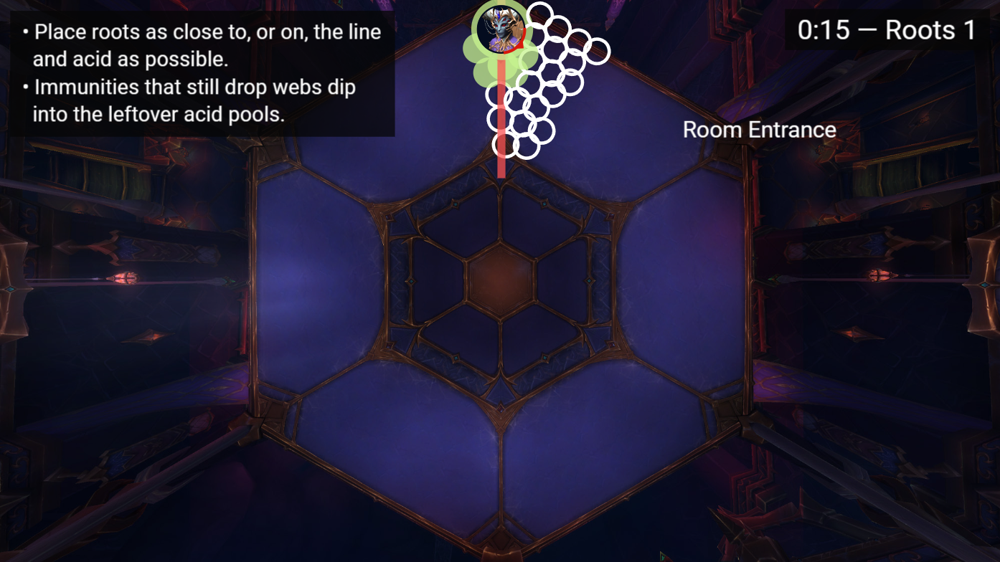

    Roots are placed as closely as possible to any preceding acid, but avoid crossing into the trapezoid on the other side of the red line as we want to keep this area clean for the intermission.

    - If you have assigned utility like Freedom, Tiger’s Lust, or Master’s Call on another player, their raid frame will glow thanks to the MRT note.
    - Tanks or those with immunities can dip into the acid before removing their root to save space.
  </TabsContent>

  <TabsContent value="slide-3">
    

    During [Web Blades](https://www.wowhead.com/spell=439299/web-blades) melee will stack with the active tank in front of the boss near the edge and ranged loosely spread on the other side of the boss.

    - The [Web Blades](https://www.wowhead.com/spell=439299/web-blades) will spawn every 0.5 seconds until 3 are spawned, after which there is a 1-second delay before they erupt every 0.5 seconds in the same order they spawned in.

    - <Image className="float-left mr-3 md:float-right md:ml-3" src={img_mechanic_web_blades} alt="Web Blades WeakAura"  /> Everyone will refer to the WeakAura on their screen and wait to move until the last blade spawns (the last green tick), or at the least stagger movement as a cohesive unit. We want to avoid someone running 20 yards ahead of the group and cutting everyone off if they are targeted.
  </TabsContent>

  <TabsContent value="slide-4">
    

    The first set of [Reactive Toxin](https://www.wowhead.com/spell=437592/reactive-toxin) goes out on 2 players and spawns 2 [Reactive Froth](https://www.wowhead.com/spell=438846) bombs.

    - A WeakAura will assign players with [Reactive Toxin](https://www.wowhead.com/spell=437592/reactive-toxin) to spawn their bomb on <Star /> (stack 1) or <Circle /> (stack 2). Consider the following when placing these bombs:
    - There will not be world markers for this set.
    - There must be enough room between these bomb circles for the raid to stack between.
    - The bombs can partially overlap the web miasma to save space. If the boss is too close the melee popper can go a half-second early.
  </TabsContent>

  <TabsContent value="slide-5">
    

    If the <Star /> and <Circle /> markers are placed correctly there will be a cubbie between the two. If there isn't, the raid can stack just outside of their intersection.
  </TabsContent>

  <TabsContent value="slide-6">
    

    If necessary, you can cheat into the middle of the room. Only cheat ahead if it prevents you from being killed. Remember, immunities (that don't prevent you from dropping webs) should be used during webs so that you may dip into the acid and save room for the rest of the group.
  </TabsContent>

  <TabsContent value="slide-7">
    

    This starts a sequence of 2 back-to-back [Web Blades](https://www.wowhead.com/spell=439299/web-blades). This image depicts the first blades, and nothing about them is different from the first time we've done them. Reminder of web blade mechanics:
    - Melee are in front of the boss with the tanks.
    - Ranged are loosely spread opposite of the melee group, behind the boss.
    - Don't move until the WeakAura shows the third blade has spawned.
    - Dodge in the same direction as your group. Otherwise, you can be out of position for the next mechanic.

    However, once we finish dodging everyone should remain in position to bait the next set of [Web Blades](https://www.wowhead.com/spell=439299/web-blades) away from where we just came from.
  </TabsContent>

  <TabsContent value="slide-8">
    

    After the first [Web Blades](https://www.wowhead.com/spell=439299/web-blades) are spawned, and we've waited where we've dodged to, we will spawn a second set. We dodge these [Web Blades](https://www.wowhead.com/spell=439299/web-blades) by still listening to the WeakAura, but back towards the wall of web miasma.

    As we are running back, the boss will spawn the 2nd set of [Reactive Toxin](https://www.wowhead.com/spell=437592/reactive-toxin) debuffs. 
  </TabsContent>

  <TabsContent value="slide-9">
    

    The second set of [Reactive Toxin](https://www.wowhead.com/spell=437592/reactive-toxin) goes on 3 players instead of 2. To deal with this we will place them in a line with the radius of each debuff touching the miasma from the webs.
    > Unlike the first set, sets of 3 toxin debuffs do not need to have a space between them.
  
    The <Diamond/> popper needs to be careful to follow the `DON'T POP` WeakAura, not the assignment WeakAura as that is an estimate. The <Diamond/> popper must always pop the moment the vulnerability falls off from <Circle/>

    <video width="100%" height="auto" controls className="rounded-xl my-5">
      <source src="/videos/ansurek_mp1_bombs3.mp4" type="video/mp4"/>
    </video>
  </TabsContent>

  <TabsContent value="slide-10">
    

    This is the *difficult* dance of the phase. The following happens in quick succession:
    
    1. `1:35` — (Prior Slide) The [Reactive Froth](https://www.wowhead.com/spell=438846) bombs have finished exploding.
    2. `1:38` — [Web Blades](https://www.wowhead.com/spell=439299/web-blades) spawn. Since we have too little time to reconvene back at the bomb miasma, we instead dodge towards the opposite side of this platform section.
    3. `1:40` — The moment we can dodge the blades coincides with [Liquefy](https://www.wowhead.com/spell=436799/liquefy) puddles. So the ranged and melee groups should move into a safe position after the third blade spawns, then stack together for Liquefy.

    Some level of mess is acceptable here in the name of safety, but avoid crossing into the next section of room. You may cheat into the middle of the room, or behind us, if you wish.
  </TabsContent>

  <TabsContent value="slide-11">
    

    After a short break from the previous mechanic set we have [Silken Tomb](https://www.wowhead.com/spell=439814/silken-tomb) roots. Then, as we're dodging with our melee and ranged groups, we get [Web Blades](https://www.wowhead.com/spell=439299/web-blades). We dodge towards the next secton of the room.
  </TabsContent>

  <TabsContent value="slide-12">
    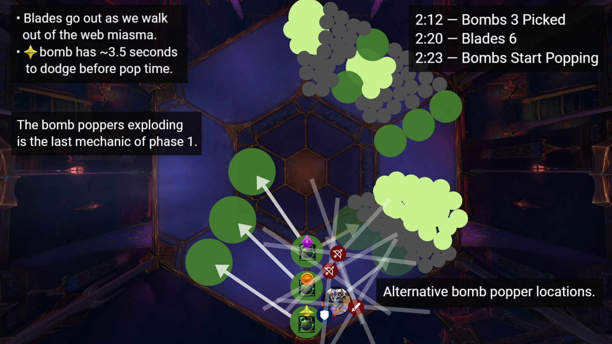

    The last overlap of the phase is [Web Blades](https://www.wowhead.com/spell=439299/web-blades) at `2:20` followed by the [Reactive Froth](https://www.wowhead.com/spell=438846) bomb-popping sequence starting at `2:23`. This is most difficult for the <Star/> group, but other players should be trying to dodge these blades towards their assigned bomb positions.
  </TabsContent>
</Tabs>

### Timers

<div className="prose w-full md:w-auto md:grid md:grid-cols-[auto_1fr] md:gap-2">
| Time | Mechanic | Count | Delta |
| --- | --- | --- | --- |
| `0:08`| [Liquefy](https://www.wowhead.com/spell=436799/liquefy) | 1 | |
| `0:09` | [Feast](https://www.wowhead.com/spell=437093/feast) | 1 | |
| `0:16` | [Silken Tomb](https://www.wowhead.com/spell=439814/silken-tomb) | 1 | |
| `0:20` | [Reactive Toxin](https://www.wowhead.com/spell=437592/reactive-toxin) | 1 | |
| `0:20` | [Web Blades](https://www.wowhead.com/spell=439299/web-blades) | 1 | |
| `0:34` | [Venom Nova](https://www.wowhead.com/spell=437417/venom-nova) | 1 | |
| `0:48` | [Liquefy](https://www.wowhead.com/spell=436799/liquefy) | 2 | 40s |
| `0:49` | [Feast](https://www.wowhead.com/spell=437093/feast) | 2 | 40s |
| `0:56` | [Silken Tomb](https://www.wowhead.com/spell=439814/silken-tomb) | 2 | 40s |
| `1:00` | [Web Blades](https://www.wowhead.com/spell=439299/web-blades) | 2 | 40s |
| `1:13` | [Web Blades](https://www.wowhead.com/spell=439299/web-blades) | 3 | 3s |
| `1:16` | [Reactive Toxin](https://www.wowhead.com/spell=437592/reactive-toxin) | 2 | 56s |
| `1:30` | [Venom Nova](https://www.wowhead.com/spell=437417/venom-nova) | 2 | 56s |
| `1:38` | [Web Blades](https://www.wowhead.com/spell=439299/web-blades) | 4 | 25s |
| `1:42` | [Liquefy](https://www.wowhead.com/spell=436799/liquefy) | 3 | 56s |
| `1:43` | [Feast](https://www.wowhead.com/spell=437093/feast) | 3 | 56s |
| `1:53` | [Silken Tomb](https://www.wowhead.com/spell=439814/silken-tomb) | 3 | 53s |
| `1:57` | [Web Blades](https://www.wowhead.com/spell=439299/web-blades) | 5 | 19s |
| `2:12` | [Reactive Toxin](https://www.wowhead.com/spell=437592/reactive-toxin) | 3 | 56s |
| `2:20` | [Web Blades](https://www.wowhead.com/spell=439299/web-blades) | 6 | 13s |
| `2:26` | [Venom Nova](https://www.wowhead.com/spell=437417/venom-nova) | 3 | 56s |
| `2:38` | [Predation](https://www.wowhead.com/spell=447076/predation) | 1 | |

  <div className="hidden md:flex flex-col justify-center items-center text-center">

    <p className="italic text-lg">A bunch of empty space.</p>
    <p>Looking to buy some lucrative timeshare opportunities in the Cayman Islands? 🏝️</p>
    
  </div>
</div>

## Intermission: The Spider's Web

There isn't anything too special about the intermission, but it's easy to get killed by the waves if you're not careful. Repetition will help everyone get used to the positioning.

The goal of the intermission is to break her shield before she casts [Wrest](https://www.wowhead.com/spell=447411/wrest) for the third time. For the duration of the intermission all previous [Grasping Silk](https://www.wowhead.com/spell=441958/grasping-silk) miasma spawned by roots, as well as [Grasping Silk](https://www.wowhead.com/spell=441958/grasping-silk) now spawned by each [Wrest](https://www.wowhead.com/spell=447411/wrest) in mythic, will grow in size. 

<Tabs defaultValue="part1">
  <TabsList>
    <TabsTrigger value="part1" prefix="Slide">1</TabsTrigger>
    <TabsTrigger value="part2" prefix="Slide">2</TabsTrigger>
    <TabsTrigger value="part3" prefix="Slide">3</TabsTrigger>
    <TabsTrigger value="part4" prefix="Slide">4</TabsTrigger>
  </TabsList>

  <TabsContent value="part1">
    
  
    The intermission starts with a [Wrest](https://www.wowhead.com/spell=447411/wrest). Fit as tightly against the acid as possible, even dipping in if you have a strong enough personal. Eveyone should stay ahead of the red line so that melee have more room to spread after.
  </TabsContent>

  <TabsContent value="part2">
    

    Melee should get comfortable and consistent with clustering between the oncoming waves. 
  </TabsContent>

  <TabsContent value="part3">
    

    The second wrest is the most dangeorus part of the intermission, but should come easily with comfort. She stops casting waves during the 6-second [Wrest](https://www.wowhead.com/spell=447411/wrest) cast, so when you see your WeakAura popup for the cast position yourself between the most recent waves. There is another red line we do not cross; we want prevent webs from taking all of the melee space.

    It's easy for players to misjudge their position with encroaching web pools and waves. When in doubt, you want to be on the left side of a wave before you're gripped.
  </TabsContent>

  <TabsContent value="part4">
    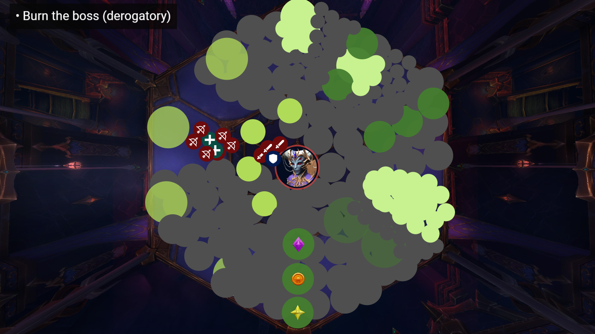

    The rest of the intermission is a burn. Get comfortable figuring out where to stand to cast your spells before she grips us or we wipe.
  </TabsContent>
</Tabs>


## Phase 2 • Royal Ascension

The second phase starts when we break her intermission shield. Specifically, we have to break her [Predation](https://www.wowhead.com/spell=447076/predation) shield before she finishes casting [Wrest](https://www.wowhead.com/spell=447411/wrest) for the third time which starts at `3:18` and finishes (wipes us) at `3:24`. The goal is clearing and ascending the platforms while preventing the [Shadowgates][shadowgate] from finishing their cast by having a pair of players swap sides. The Ascended Voidspeakers, Chamber Guardians, and Chamber Expellers share health across sides with the exception of the lone Chamber Guardian on melee side platform 2.

- We start on the phase 1 platform by killing an Ascended Voidspeaker.
- We are knocked up to platform 1 with a Chamber Guardian, the tanked mob that spawns [swirlies](https://www.wowhead.com/spell=448147/oust), and a Chamber Expeller with their [beam][expulsion-beam].
- We scuttle over to platform 2, the "melee" and "ranged" platforms:
  - Both sides have another Chamber Expeller with a [beam][expulsion-beam], a Devoted Worshipper with 1 health and a [shield][worshippers-protection], and Caustic Skitterers on the bridge.
  - The melee side also has a Chamber Guardian, the tanked mob that spawns [swirlies](https://www.wowhead.com/spell=448147/oust).
  - The ranged side has a brand-new mob, the <Sparkles>Chamber Acolyte</Sparkles>. Two spawn suspended above the left and right sides of the platform. They are not reachable by melee and spam a 10 second cast, [Dark Detonation](https://www.wowhead.com/spell=455374/dark-detonation) that will kill everyone on the platform if it goes off. We will orchestrate kicks with the Interrupt Anchor WeakAura.
- We mosey over to the last platform, killing another Ascended Voidspeaker which knocks us to the phase 3 platform.

<Tabs defaultValue="1">
  <TabsList>
    <TabsTrigger value="1">Platform 0</TabsTrigger>
    <TabsTrigger value="2">Platform 1</TabsTrigger>
    <TabsTrigger value="3">Platform 2</TabsTrigger>
    <TabsTrigger value="4">Platform 3</TabsTrigger>
  </TabsList>

  <TabsContent value="1">
    
    

    As we enter the second phase the raid will split and deal with the Ascended Voidspeakers spawning in front of their assigned sides. You may see the following nomenclature throughout the known cosmos for the sides:

    - **Melee, Left, Close, or North**: Northermost on the minimap, or to the left of our position post-intermission facing Ansurek.
    - **Ranged, Right, Far, or South**: Southermost on the minimap, or to the right of our position post-intermission facing Ansurek.

    <Callout type="info">

    The Northern Sky WeakAuras use `Left` and `Right` nomenclature, but this is not important. For example, if a WeakAura says `Gate → Right`, there is only one gateway you can take and it's on the platform you're already on — all you must know is it wants you to use the Shadowgate. I much prefer calling them the melee and ranged platforms, so I'll be referring to them as such. Whatever reason you think this preference is wrong will only make me think less of you, so keep it to yourself.

    </Callout>

    After everyone briefly collects their dignity from being ragdolled in the intermission, we split into our groups and moves to their respective Voidspeaker.
    
    - The goal is to kill the Voidspeakers in under 20 seconds.
      - We want to only need to use the Shadowgates once. The Shadowgates cast for 12 seconds, and if the first swap happens at 4 seconds left, we have those first 8 seconds + 12 from the second cast, or a 20 second hard limit. These first people can go at like, ~2 seconds, but don't play any risky games edging the gate.
      - During progression we may need to use the Shadowgates a second time on this platform if we aren't killing the Shadowspeakers fast enough.
      - <span className="text-accent">Do not</span> use any kind of damage cooldowns here and save them for the next platform.
    - The Voidspeaker [interruptable cast][shadowblast] and [orbs][gloom-orbs] are simple, but if anyone falls asleep at the wheel these are 1-shot mechanics. Ranged should also stay away from melee whenever possible to not spawn the orbs in melee.
      <Callout type="error">
      
      I understand that everyone might be taking blood pressure pills exiting the intermission, but don't fall asleep at the wheel. If you forget your interrupt and get someone killed, don't call for a backup for said interrupt, or get yourself killed thinking you can finish a cast before moving out of the path of the orbs, you can easily be ending a pull 3.5 minutes in for no reason. These are literally the only two mechanics active at the time for most people.
      
      </Callout>

    <hr className="my-6" />

    {/* TODO: Detect headers in blocks and don't make them darker */}
    <h3 className="text-foreground! opacity-100!">Shadowgate Rundown ✨</h3>
    
    The first Shadowgates we will assign a pair of healers to swap sides. These healers will need to wait for the Shadowgate cast to be near its end. Swapping anywhere from 4 to 2 seconds before the cast finishes will suffice. These healers can then dispel themselves immediately, right on top of the Shadowgate, or slightly to the side, it doesn't matter Mr. Pollock. When everyone else should use the gates is described in the next slide, but I discuss the assignment aura below so don't skip ahead sweaty.

    - The tanks will keep the Voidspeakers directly in line with the Shadowgate, only moving it forward a few yards if needed to avoid the [Gloom](https://www.wowhead.com/spell=443403/gloom) miasma from the [debuff][gloom-touch].
    - <div className="grid grid-cols-1 md:grid-cols-[1fr_auto] gap-3">
        <div className="prose">

          The Shadowgate assignment WeakAura is a pair of bars visible that represent the cast time of the actual Shadowgates themselves. As a reminder, when this 12 second cast reaches 0, everyone nearby dies, so we send someone through to force the gate to restart its cast. When we clear a platform the gates also reset their cast as they move to the next platform.
        
        </div>
        <div className="prose">

          <p><Image src={img_mechanic_shadowgate} alt="Phase 2 Shadowgate Bar" /></p>
        
        </div>
      </div>

    - The assignment aura will pick the next viable (not deceased) person in the assignment list for each cast. This person will see in the middle of their screen something like, `GATE --> RIGHT` or `GATE --> LEFT` and a countdown until the Shadowgate explodes. This isn't a countdown to when you should go through the gate, again, this is a countdown to when it kills us. If you aren't the very first set of players swapping, when you use the gate is also again, explained in the next slide. 

    - Don't stress your melon about the left and right in the WeakAura. If you want to understand it or you'll explode, it means said person is *going to* that side. In the picture, `Waysoone (Right)` means Waysoone is currently on the left platform, or melee side, and is being sent to the right, or ranged, side. Waysoone doesn't need to know this though, as all they need to know is they're next to use the gateway on their side.

  </TabsContent>

  <TabsContent value="2" className="prose">

    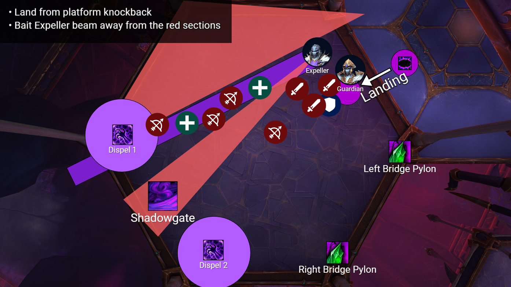

    <div className="grid lg:grid-cols-[1fr_auto] gap-4">
      <div className="prose">

        The principle dance of abilities dealt with by both groups is a beam followed by a grip. It's typical but not guaranteed that the ranged side will get the first and third grips while the melee side will get the second. Importantly, the platform that gets the first grip has their beam go off with about ~3.5 seconds left before the grip whereas the platform that gets the second grip has their beam go off with 2 seconds left on the grip.

        It's possible, and likely during progression, that the third grip will go off. If this happens there shouldn't be any other mechanics to deal with or positional requirements, just do your best to survive.

        - You land on your platform and position so you're baiting the beam <span className="underline">away</span> from the red-covered areas pictured.
        - If your side gets the first grip, wait for the beam to spawn then position for the [grip][phase2-wrest]. If your side gets the second grip, bait the second beam just shy of where you'll be for the grip. 
          
          <Callout type="warning">

          Be at least 20 yards from the Shadowgate so you're not covering it in miasma. The topmost red area in the picture is the best spot to get [gripped][phase2-wrest] because the resulting miasma will be out of everyone's way.

          </Callout>

        - If you're up next to use the [Shadowgate][shadowgate] pay attention to *where* the next [grip][phase2-wrest] will be.
          - If your current side starts getting gripped, aka she puts a tether on you, step through when the gate has around 4 seconds left on its timer. This should be about 2 seconds into the grip cast.
          - If the other side is getting gripped, look at Ansurek's boss frame cast bar and step through 1-2 seconds before the cast finishes. Your gate should have around 2 seconds left on its cast.

          <Callout type="error">

          It's intentional that the player gating to the side getting gripped go ~2 seconds after the other gate user. The grip does moderate damage to the other side while their healers are moonwalking. Healers cannot dispel you until after the grip <span className="underline font-bold italic">and</span> the group is sufficiently healthy. Dispelling you anytime before then could kill people. Thus, going over early only keeps you away from the mobs for longer.

          </Callout>

      </div>
      <div className="prose sticky top-0 self-start">
        | Time | Mechanic | Count | 
        | --- | --- | --- | 
        | 3:52 | Land | |
        | 3:55 | [Grip][phase2-wrest] Start | 1 |
        | 3:56 | ├ [Beam][expulsion-beam] | 1 |
        | 3:57 | ├ [Shadowgate][shadowgate] | 1 |
        | 3:59 | └ [Shadowgate][shadowgate] | 2 |
        | 4:00 | [Grip][phase2-wrest] End | 1 |
        | 4:03 | [Grip][phase2-wrest] Start | 2 |
        | 4:05 | ├ [Shadowgate][shadowgate] | 3 |
        | 4:06 | ├ [Beam][expulsion-beam] | 2 |
        | 4:07 | └ [Shadowgate][shadowgate] | 4 |
        | 4:08 | [Grip][phase2-wrest] End | 2 |
        | 4:11 | [Grip][phase2-wrest] Start | 3 |
        | 4:16 | [Grip][phase2-wrest] End | 3 |
      </div>
    </div>
  </TabsContent>

  <TabsContent value="3">
    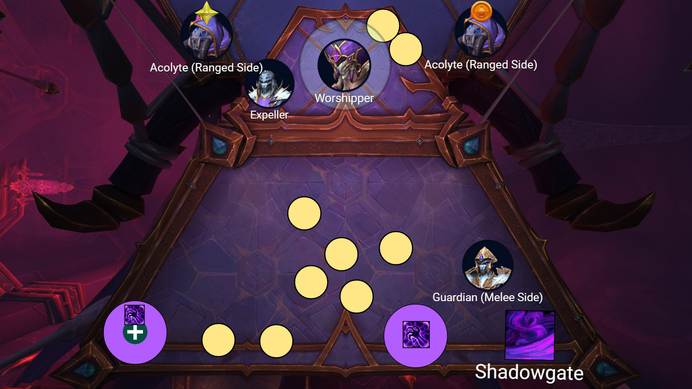
    
    <div className="grid lg:grid-cols-[1fr_auto] gap-4">
      <div className="prose">
        The strategy for the second platforms is to ensure we have enough ranged on the ranged platform to deal with the Devoted Acolytes while still clearing both platforms in roughly the same time despite only the Expeller sharing health. We deal with this by, generally, starting with ranged and melee on opposite sides to their role and swapping them using the portals before the second platform.
        
        The remainder of the mechanics on the second platform are ubiquitous with the only difference being, again, if a side gets the first or second [grip][phase2-wrest]. However, we can pick which side gets the first grip by having someone on that side reach the second platform first, probably a <Warrior /> leaping up the web bridge or similar. It's not important which side gets the first grip, only that we're consistent with it.

        <hr className="my-5" />

        - The first mechanic is [Gloom Touch](https://www.wowhead.com/spell=464056/gloom-touch) on a random healer per side. It will take a few seconds for the Devoted Worshipper to smell that healers are on the platform, but healers should stack in the back left edge of the platform and whoever gets it dispels themselves immediately.
        - The Chamber Expeller will jump to the left side of the Devoted Worshipper, making the only worthwhile [beam][expulsion-beam] bait position the left side of the platform. Everyone should try to stay as far left as possible until the first beam goes out.
        - Positions for the [grip][phase2-wrest] are not as important as the Shadowgate is next to the bridge and nobody should be over there. However, try to leave the area along the back wall next to the Shadowgate clear for [Gloom Touch](https://www.wowhead.com/spell=464056/gloom-touch) dispels. The second dispel can happen on top of the Shadowgate itself.
        - The Shadowgate assignment logic from the first platform applies here as well. If you're going to get gripped, go through the gate about two seconds into the grip cast. If you're not getting gripped, go through right before the cast on the other side finishes.
      </div>
      <div className="prose sticky top-0 self-start">
      | Time | Mechanic | Count |
      | --- | --- | --- |
      | 4:22 | [Beam][expulsion-beam] | 1 |
      | 4:22 | [Grip][phase2-wrest] Start | 1 |
      | 4:24 | ├ [Shadowgate][shadowgate] | 1 |
      | 4:26 | └ [Shadowgate][shadowgate] | 2 |
      | 4:27 | [Grip][phase2-wrest] End | 1 |  
      | 4:30 | [Grip][phase2-wrest] Start | 2 |
      | 4:32 | ├ [Beam][expulsion-beam] | 2 |
      | 4:32 | ├ [Shadowgate][shadowgate] | 3 |
      | 4:34 | └ [Shadowgate][shadowgate] | 4 |
      | 4:35 | [Grip][phase2-wrest] End | 2 |  
      </div>
    </div>
  </TabsContent>

  <TabsContent value="4">

    

    The final platform is just like the start of phase 2 with a lone Ascended Voidspeaker.
    
    - Follow the [Shadowblast][shadowblast] kick rotation.
    - Ranged stay away from melee and the Voidspeaker to bait the [Gloom Orbs][gloom-orbs].
    - Use the [Shadowgates][shadowgate] when when safe but avoid going early. When the Voidspeaker dies, the Shadowgate will disappear.

    <Callout type="warning">

    It's not a good idea for tanks to drag the Voidspeakers towards the edge of the platform. It's better for them to remain in the middle so ranged can easily spread around it and the melee. The knockback is equally potent within its 45 yard range.

    </Callout>

  </TabsContent>
</Tabs>

## Phase 3 • Paranoia's Feast

<div className="grid lg:grid-cols-[1fr_auto] gap-4">
  <div className="prose">
  The only mechanical difference on mythic is that [Acolyte's Essences][essence] are not consumed by using the [Abyssal Conduit][abyssal-conduit] portals. Most of the strategy is optimizing placement of [Gloom][gloom] miasma and keeping Ansurek within cleave range of active adds as the phase is simplified greatly by skipping the later add sets.

  - She enters her Sailor Moon era by casting [Aphotic Communion](https://www.wowhead.com/spell=449986/aphotic-communion) for 20 seconds when we reach her platform.
  
  - The tank mechanics [Infest][infest] and [Gorge][gorge] spawn adds and swirlies respectively.
  
    - [Infest][infest] puts a 15yd [debuff][infested-gloomburst] on the tank that spawns [Gloom Hatchlings][gloom-hatchling] after 5 seconds that wipe the raid if they reach the boss and spawn [miasma][gloom] where they die.
  
    - [Gorge][gorge] does raid damage and spawns [swirlies][gloom-splatter] under players that leave [miasma][gloom].
  
  - [Web Blades][web-blades] return from phase 1.
  
  - [Royal Condemnation][royal-condemnation] debuffs go out on 3 players dealing massive damage to all players reduced by distance and spawning [Royal Shackles][royal-shackles] that grip players with increasing strength, [stunning them](https://www.wowhead.com/spell=441872/royal-cocoon) if they are too close.

  - [Dreadful Presence](https://www.wowhead.com/spell=445268/dreadful-presence) is periodic rot damage that is increased by 20% for every set of portals and acts as a soft enrage where she will not stop casting the [ring][frothing-gluttony] if she reaches 4 stacks.

  The major mechanics are the trifecta of Summoned Acolytes that drop [essences][essence] that Ansurek tries to eat with a collapsing [shadow ring][frothing-gluttony] so we use [debuffs][abyssal-infusion] that drop [portals][abyssal-conduit] to teleport the essences to safety.

  - Summoned Acolytes cast increasing [raid damage][null-detonation] that we can't interrupt until we break their [shield][dark-barrier]. When they die, they drop an [essence] players can pick up for 15 seconds, after which it falls back on the floor. We have to rotate who picks up essences as players become [vulnerable](https://www.wowhead.com/spell=446012/essence-scarred) to subsequent essences after dropping one.

  - Ansurek teleports to the center of the platform and [pulls][glutton-threads] players towards her, [killing](https://www.wowhead.com/spell=461408/consume) them if they are pulled too close while a [shadow ring][frothing-gluttony] collapses from the edges of the platform towards her location. The raid is [killed](https://www.wowhead.com/spell=445877/froth-vapor) if there are any Acolytes alive when she casts this, or the ring touches an [essence].

  - Prior to this, two players are conveniently given a [debuff][abyssal-infusion] that leave behind a [portal][abyssal-conduit]. We place them at the outside and inside edges of the platform and step through the inner portal once the [ring][frothing-gluttony] passes the outer to save ourselves and the essences from the ring.

    - Stepping through a [portal][abyssal-conduit] gives a [circle debuff][abyssal-reverberation] that explodes for large damage within 8 yards after 4 seconds, requiring players to spread out after passing through the portal.

    - If someone with an [essence] uses a portal it will quickly [destabilize](https://www.wowhead.com/spell=444502/conduit-collapse) and explode.

    - Portals shoot lethal [orbs][conduit-ejections] when they're created or destroyed as well as leaving [miasma][gloom] behind.
  </div>
  <div className="prose sticky top-0 self-start">
  | Time | Mechanic | Count |
  | --- | --- | --- |
  | 5:44 | [Aphotic Communion](https://www.wowhead.com/spell=449986/aphotic-communion) | 1 |
  | 5:56 | [Infest][infest] | 1 |
  | 5:57 | [Gorge][gorge] | 1 |
  | 6:12 | [Queen's Summons][queens-summons] | 1 |
  | 6:13 | [Web Blades][web-blades] | 1 |
  | 6:23 | [Abyssal Infusion][abyssal-infusion] | 1 |
  | 6:42 | [Frothing Gluttony][frothing-gluttony] | 1 |
  | 6:50 | [Web Blades][web-blades] | 2 |
  | 7:02 | [Infest][infest] | 2 |
  | 7:03 | [Gorge][gorge] | 2 |
  | 7:11 | [Web Blades][web-blades] | 3 |
  | 7:16 | [Queen's Summons][queens-summons] | 2 |
  | 7:22 | [Royal Condemnation][royal-condemnation] | 1 |
  | 7:28 | [Web Blades][web-blades] | 4 |
  | 7:43 | [Abyssal Infusion][abyssal-infusion] | 2 |
  | 8:02 | [Frothing Gluttony][frothing-gluttony] | 2 |
  | 8:09 | [Web Blades][web-blades] | 5 |
  | 8:21 | [Infest][infest] | 3 |
  | 8:22 | [Gorge][gorge] | 3 |
  | 8:39 | [Queen's Summons][queens-summons] | 3 |
  | 8:38 | [Royal Condemnation][royal-condemnation] | 2 |
  | 8:50 | [Web Blades][web-blades] | 6 |
  | 9:03 | [Abyssal Infusion][abyssal-infusion] | 3 |
  | 9:26 | [Web Blades][web-blades] | 7 |
  | 9:30 | [Frothing Gluttony][frothing-gluttony] | 3 |
  </div>
</div>

<Callout type="info">

Players should use teleports to avoid the ring in lieu of portals wherever possible. The debuff from using a portal does a lot of damage and requires players to spread out which is safer with less debuffs. It's also important to be aware that immunities do not prevent the massive DoT (which also slows you by 60%). Nonetheless, if you are trying to save an essence in a bad spot and won't make it back to the portal, if you layer enough defensives to get through the ring the essence will not explode unless you die and it falls onto the ring.

</Callout>

<Tabs defaultValue="1">
  <TabsList>
    <TabsTrigger value="1">Part 1</TabsTrigger>
    <TabsTrigger value="2">Part 2</TabsTrigger>
    <TabsTrigger value="3">Part 3</TabsTrigger>
    <TabsTrigger value="4">Part 4</TabsTrigger>
    <TabsTrigger value="5">Part 5</TabsTrigger>
    <TabsTrigger value="6">Part 6</TabsTrigger>
  </TabsList>

  <TabsContent value="1">

    

    - Once we reach her platform she casts [Aphotic Communion](https://www.wowhead.com/spell=449986/aphotic-communion) for 20 seconds so we can blast before she lands at <Moon/>.
    - Ranged will stack on the edge of the platform with their right shoulder by pillar across from <Moon />. Melee will stay tightly stacked against the edge of the platform as she is dragged to the pillar across from <Star />. 
    - The first tank gets [Infest][infest], spawning [Gloom Hatchlings][gloom-hatchling].
      - If any of these spiderbebbies reach her it will be a wipe. We will lay out a [Ring of Peace](https://www.wowhead.com/spell=116844/ring-of-peace) and immediately stun and <span className="text-red-400">focus them down</span>.
      - Melee don't be in the circle around the tank, [Infested Gloomburst][infested-gloomburst].
    - The other tank will taunt for [Gorge][gorge], dealing raid damage and causing [Gloom Splatter][gloom-splatter] to spawn [Gloom][gloom] swirlies under players feet everyone pre-stacked for.
      - This tank should stutter-step Ansurek slightly away from the location the adds are spawning from.
      - Ranged should stutter-step along the edge of the platform not into the room to maximize platform space.

  </TabsContent>

  <TabsContent value="2">
    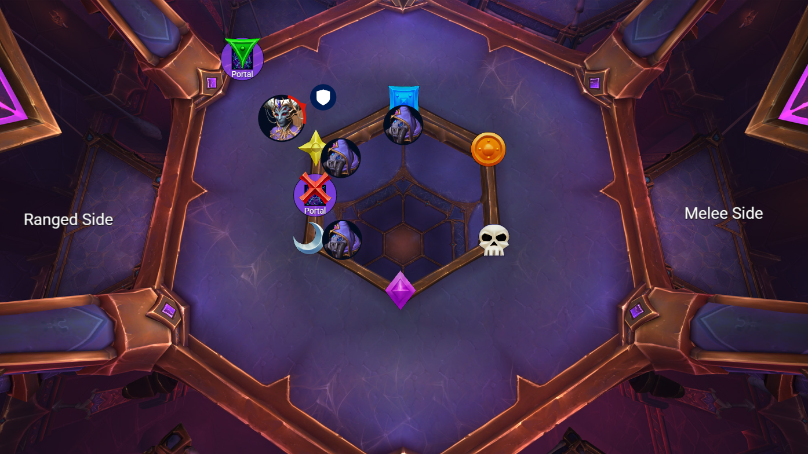

    - Next we get 3 Summoned Acolytes while we dodge [Web Blades][web-blades]. 
      - Ansurek must be near <Star /> as she summons the Acolytes centered on the closest corner of the inner hexagon.

    - The raid will focus on killing the adds with Ansurek positioned in cleave range of <Star /> until it dies, then moving to <Square />. Ranged will focus on the Acolyte at <Moon />.

        - Use [Curse of Tongues](https://www.wowhead.com/spell=199890/curse-of-tongues) on any Acolyte that melee isn't currently dealing with, as melee will melt their shield and make them interruptable.
        - The [essences][essence] spawn directly in front of the markers, so melee should be careful not to accidentally pick them up, nor should Ansurek be tanked directly in front of a marker.

    - Ansurek will then put [Abyssal Infusion][abyssal-infusion] on two players that drop [portals][abyssal-conduit] after 6 seconds. We want one of them in melee at <Cross /> and one at ranged on <Triangle />.
        - You may be marked by BigWigs but they mean nothing and since you have 6 seconds there are no assignment auras.
        - Be careful as [orbs][conduit-ejections] will shoot out of their spawning location.

    - As the portals open and players are dodging the [orbs][conduit-ejections] the first 3 players will see a WeakAura telling them when to pick up an [essence]. Any essence. Coordinate with your fellow essence-touchers or Briar as to which one you want.

      <div className="flex justify-center"> 
        <figure>
          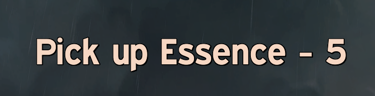
          <figcaption>
            There is nothing special about the WeakAura. It only says when you're meant to pick up __any__ of the 3 essences.
          </figcaption>
        </figure>
      </div>
  </TabsContent>

  <TabsContent value="3">
    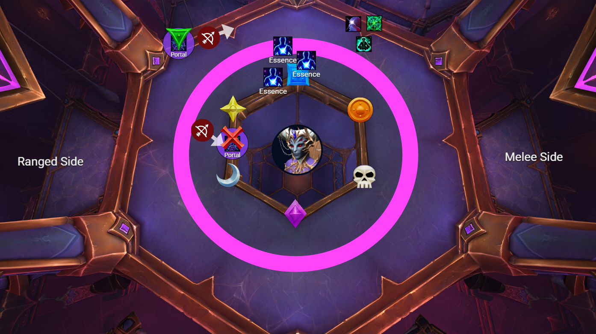

    - Ansurek will then teleport to the middle and cast the [ring][frothing-gluttony].
      - Players who can teleport over the ring should do so in the area between <Square /> and <Circle /> to give the other players space to spread out with their [debuffs][abyssal-reverberation]. This is also where the boss will be next.
      - The cast time for this ability is 5 seconds, which is enough time to disengage and prepare things like [Transcendance](https://www.wowhead.com/spell=101643/transcendence).

    - If you cannot teleport over the ring, there is a WeakAura that will tell you when to use the portal. Follow it exactly!
      - The WeakAura instructs melee to go 1 second before ranged as melee are often faster moving and can spread out from the exit portal further. Melee should spread as far as they can to help the ranged.
      - Essence holders are told to go 0.5 seconds after ranged as any essence holder going through the portal causes it to quickly destabilize and explode.
      - As you spread out be weary of the portals as they will spawn more [orbs][conduit-ejections] and leave [miasma][gloom] behind.

    - The next sequence is [Web Blades][web-blades] while the 3 [essences][essence] are expiring and about to fall on the floor.
      - Essence holders will place their now expiring essences slightly behind <Square /> while avoiding dropping their essence directly on the marker; see the picture below.

        <Callout type="warning">
        Players without essences should not be anywhere near <Square />. The essences fall off the moment we start dodging [Web Blades][web-blades], and if they're playing bumper cars with your portal debuff you can prevent them from dropping their essence in the correct location.
        </Callout>

      - The only important bit is that the essences safely in the trapezoid formed  by <Star />, <Square /> and the pillars opposite them. It's incredibly dangerous if an essence were to be placed anywhere past the line drawn from <Square /> to the pillar opposite it, aka the next section of the room we'll be playing in.

      <figure className="flex flex-col justify-center items-center text-center">
        

        <figcaption>
          The blue area represents the area reserved for essence players to dodge mechanics and place their essences. However, they should try not to drop their essence directly on top of the marker as the raid will need to stack here later.
        </figcaption>
      </figure>
  </TabsContent>

  <TabsContent value="4">
    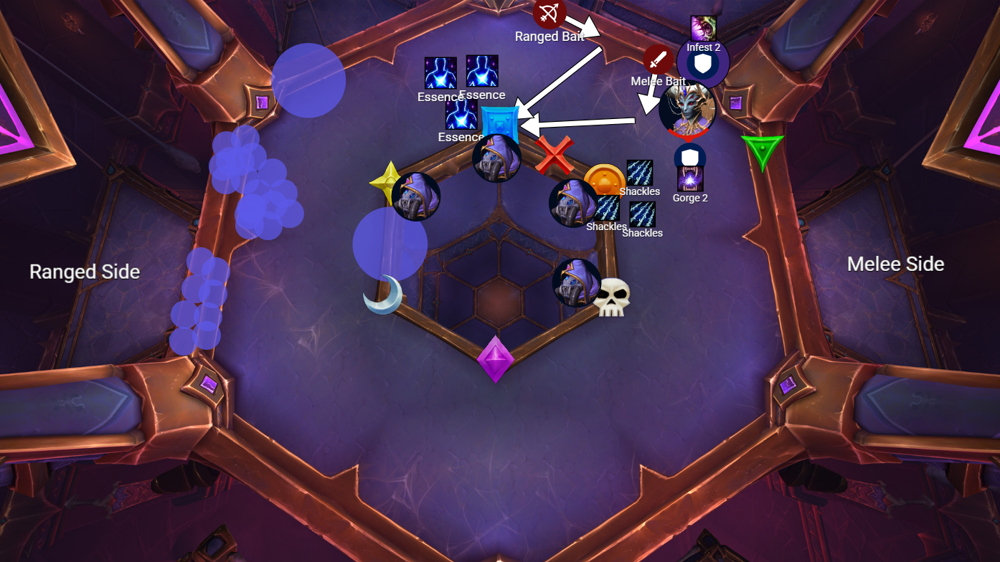

    - The sequence resets with another set of adds from [Infest][infest] and puddles from [Gorge][gorge] where the ranged are on the edge by the pillar across from <Square /> and the boss by the pillar across from <Circle />.
      - Remember, ranged should stutter-step forward to avoid the puddles. Melee follows the stutter movements of the boss.
    - There will be [Web Blades][web-blades] during the add set.
    - Next, we simultaneously get our first [Royal Condemnation][royal-condemnation] debuffs while 4 Summoned Acolytes will spawn.
      - The players with [Royal Condemnation][royal-condemnation] will go to <Circle /> to spawn the [Royal Shackles][royal-shackles]. These players need to pop a large personal and healers external them.
      - Everyone else and the boss will stack on <Square /> to kill that Acolyte while the [Royal Condemnation][royal-condemnation] debuffs explode. Ranged will focus on the <Star /> acolyte and the shackles as they spawn.
      - The <Square /> acolyte will melt, after which the boss is taken to <Circle /> to burn down the shackles and nearby Acolyte, then lastly <Skull />.
    
    <Callout type="error">
      When we move to <Square/> to counter the falloff damage of the [Royal Condemnation][royal-condemnation] debuffs, the raid needs to be extremely careful not to accidentally pick up any of the nearby essences. Similarly, when kill the Acolytes players need to avoid the newly spawned essences as well.
    </Callout>
  </TabsContent>

  <TabsContent value="5">
    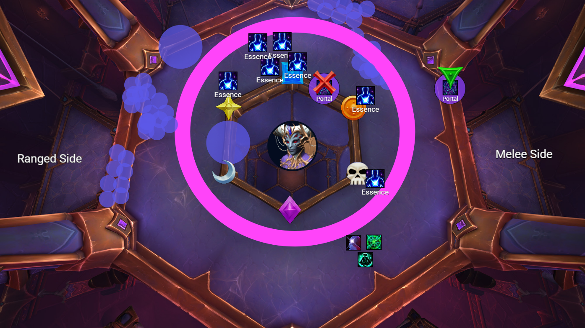

    - New [portal][abyssal-conduit] debuffs go out, placed at the new locations of <Cross /> and <Triangle /> and spawning [orbs][conduit-ejections] to dodge.
    - The [ring][frothing-gluttony] sequence repeats, now with 7 essences on the floor. The WeakAura will show assigned players a countdown when to pick up an essence, and another WeakAura will tell everyone when to use the portal.
      - Those who can teleport should do so in the <Diamond / > & <Skull /> area.
    - After the ring the essences can be hapharzardly dropped near <Circle />. We are not going to be touching the essences again.
  </TabsContent>

  <TabsContent value="6">
    

    - The final [Infest][infest] spawns some adds while ranged are across from <Skull /> and the boss across from <Diamond />. There will be [Web Blades][web-blades] as we kill the adds.
    - We will move the boss towards <Skull /> then we burn the boss or we die trying.
    - Players who get [Royal Condemnation][royal-condemnation] will just fuck off towards like <Moon />, pop personals, and make it back.
    - Melee will incidentally kill the <Skull /> Acolyte and ranged can cleave off of the others so that we remove their shields to get some interrupts, but killing them is <Sparkles>not important</Sparkles>.

  </TabsContent>
</Tabs>

## Videos

This Stankie video is a good high-level overview of the fight.
<Video src="https://www.youtube.com/watch?v=7z-LtOGJjPk&t=137s" />

Dratnos explains well the reasonings behind certain setups, issues that may arrise, and tank specific positioning. Beware that this is a pre-nerf video, but he discusses this in a pinned comment.
<Video src="https://www.youtube.com/watch?v=09u9YjCbeZ8" />

A Fury Warrior pov video from Northern Sky's kill. This is pre-nerf, but it's not visually cluttered and they are the patrons of our WeakAura pack, and therefore, we mimic their core strategies.

<Video src="https://www.youtube.com/watch?v=R-lWgXcRJ2E" />

## Nerf History

This doesn't include the [hotfix](https://www.wowhead.com/news/nerub-ar-palace-tuning-hotfixes-ulgrax-nerfed-and-mythic-boss-tuning-346665) [nerfs](https://www.wowhead.com/news/mythic-queen-ansurek-nerfed-race-to-world-first-nerub-ar-palace-347036) prior to the World First kill from Liquid.

### Tuesday, November 12th, 2024

- Web Blades
    - Number of targets reduced to 3 (was 4).
    - Grasping Silk damage reduced by 25%.
- Phase 1:
    - Number of Reactive Toxins applied per cycle no longer increases beyond 3 (was up to 4).
    - Removed second Silken Tomb cast from the final cycle of the phase, and adjusted the timings of other abilities in this final cycle to accommodate this change.
    - Silken Tomb health reduced by 30%.
    - Frothy Toxin damage reduced by 23%.
- Phase 2:
    - Shadowy Distortion duration reduced to 30 seconds (was 3 minutes).
    - Gloom Blast damage reduced by 20%.
- Phase 3:
    - Number of Summoned Acolytes per cycle no longer increases beyond 4 (was up to 5).
    - Removed the first cast of Royal Condemnation from the final cycle of the phase, and adjusted the timings of some other abilities in this final cycle to accommodate this change.
    - Removed Web Blades casts that overlapped with applications of Abyssal Infusion.


[web-blades]: <https://www.wowhead.com/spell=439299/web-blades> "Web Blades"
[expulsion-beam]: <https://www.wowhead.com/spell=451600/expulsion-beam> "Expulsion Beam"
[phase2-wrest]: <https://www.wowhead.com/spell=450191/wrest> "Wrest"
[shadowgate]: <https://www.wowhead.com/spell=460369/shadowgate> "Shadowgate"
[worshippers-protection]: <https://www.wowhead.com/spell=448488/worshippers-protection> "Worshippers Protection"
[shadowblast]: <https://www.wowhead.com/spell=447950/shadowblast> "Shadowblast"
[gloom-orbs]: <https://www.wowhead.com/spell=448176/gloom-orbs> "Gloom Orbs"
[gloom-touch]: <https://www.wowhead.com/spell=464056/gloom-touch> "Gloom Touch"
[infest]: <https://www.wowhead.com/spell=443325/infest> "Infest"
[infested-gloomburst]: <https://www.wowhead.com/spell=443667/infested-gloomburst> "Infested Gloomburst"
[gloom-hatchling]: <https://www.wowhead.com/spell=443720/gloom-hatchling> "Gloom Hatchling"
[gorge]: <https://www.wowhead.com/spell=443336/gorge> "Gorge"
[gloom-splatter]: <https://www.wowhead.com/spell=443396/gloom-splatter> "Gloom Splatter"
[gloom]: <https://www.wowhead.com/spell=443403/gloom> "Gloom"
[dark-barrier]: <https://www.wowhead.com/spell=445013/dark-barrier> "Dark Barrier"
[null-detonation]: <https://www.wowhead.com/spell=445021/null-detonation> "Null Detonation"
[essence]: <https://www.wowhead.com/spell=445152/acolytes-essence> "Acolyte's Essence"
[abyssal-infusion]: <https://www.wowhead.com/spell=443888/abyssal-infusion> "Abyssal Infusion"
[abyssal-reverberation]: <https://www.wowhead.com/spell=455387/abyssal-reverberation> "Abyssal Reverberation"
[abyssal-conduit]: <https://www.wowhead.com/spell=443915/abyssal-conduit> "Abyssal Conduit"
[queens-summons]: <https://www.wowhead.com/spell=444829/queens-summons> "Queen's Summons"
[frothing-gluttony]: <https://www.wowhead.com/spell=445422/frothing-gluttony> "Frothing Gluttony"
[glutton-threads]: <https://www.wowhead.com/spell=445623/glutton-threads> "Glutton Threads"
[conduit-ejections]: <https://www.wowhead.com/spell=444507/conduit-ejections> "Conduit Ejections"
[royal-shackles]: <https://www.wowhead.com/spell=441865/royal-shackles> "Royal Shackles"
[royal-condemnation]: <https://www.wowhead.com/spell=438976/royal-condemnation> "Royal Condemnation"